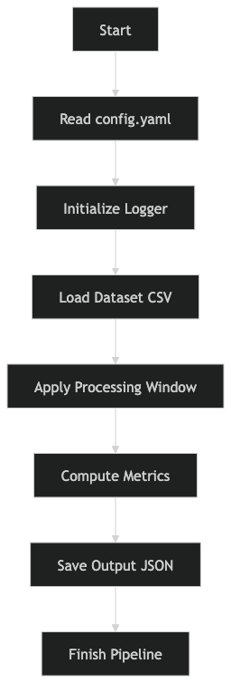

# ML/MLOps PrimedataAI Task 0


## Overview
This project implements a minimal MLOps-style batch pipeline that demonstrates:

- Reproducibility (config-driven + seed)
- Observability (structured logs + metrics JSON)
- Deployment readiness (Dockerized execution)

The pipeline loads OHLCV data, computes a rolling mean on `close`, generates binary trading signals, and outputs structured metrics.

---

## Project Structure

run.py
config.yaml
data.csv
requirements.txt
Dockerfile
src/


---

## Local Run

```BASH
python run.py --input data.csv --config config.yaml --output metrics.json --log-file run.log
```

## Build:
```BASH
docker build -t mlops-task .
```

## Run:
```BASH
docker run --rm mlops-task
```


## Example Output

```BASH

{
  "version": "v1",
  "rows_processed": 10000,
  "metric": "signal_rate",
  "value": 0.0,
  "latency_ms": 30,
  "seed": 42,
  "status": "success"
}
```

A lightweight MLOps-style data processing system designed to demonstrate production engineering concepts such as:

- Configuration-driven execution
- Logging & observability
- Reproducibility via seeds
- Structured pipeline design
- Modular Python architecture

This project simulates how real-world ML/Data pipelines are structured before deploying machine learning models at scale.

## PROJECT OVERVIEW

The goal of this project is to build a clean, modular, reproducible pipeline where:

- System behavior is controlled through configuration files
- Processing logic is isolated inside modules
- Execution is monitored through logging & metrics
- Outputs are saved in structured formats

This mimics industry MLOps workflows where experimentation and production pipelines must remain consistent.

# HIGH LEVEL ARCHITECTURE


# END-TO-END FLOWCHART



# PROJECT STRUCTURE

```BASH

mlops-task-0/
│
├── src/
│   ├── logger.py        # Logging setup
│   ├── config.py        # Configuration loader
│   ├── processor.py     # Core processing logic
│   ├── metrics.py       # Metrics calculation
│   └── utils.py         # Helper functions
│
├── config.yaml          # Pipeline configuration
├── data.csv             # Input dataset
├── output.json          # Pipeline results
├── requirements.txt
└── main.py              # Entry point
```

# CONFIGURATION-DRIVEN DESIGN

Pipeline behavior is controlled using YAML:

```BASH

seed: 42
window: 5
version: "v1"
```

# CONFIG FILE ENABLES:

- Reproducibility (fixed seed)
- Easy experimentation
- Zero code modification runs

# LOGGING SYSTEM

The project uses Python logging instead of print statements.

Why Logging?

In real MLOps systems:

- Pipelines run on servers
- Developers can’t see console output
- Logs help debug failures and monitor execution

# LOGGER FLOW


# Pipeline Execution Logic

Step 1 — Config Initialization

- Reads parameters from YAML
- Sets reproducible environment

Step 2 — Data Loading

- CSV dataset is loaded
- Input validation happens

Step 3 — Processing Phase

Core logic runs:

- Window-based operations
- Data transformation
- Signal extraction

Step 4 — Metrics Generation

Pipeline computes result statistics:

```BASH
{
  "version": "v1",
  "rows_processed": 10000,
  "metric": "signal_rate",
  "value": 0.0,
  "latency_ms": 26,
  "seed": 42,
  "status": "success"
}
```

# DATA FLOW DIAGRAM


# DEPENDENCIES USED

pandas
numpy
pyyaml

# Real-World Use Cases

This architecture is similar to systems used for:

- ML feature preprocessing pipelines
- Data validation workflows
- Signal processing systems
- Batch analytics jobs
- Experiment tracking pipelines
